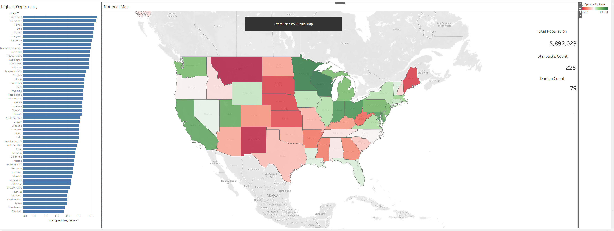
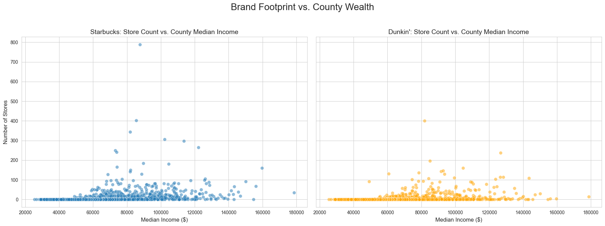
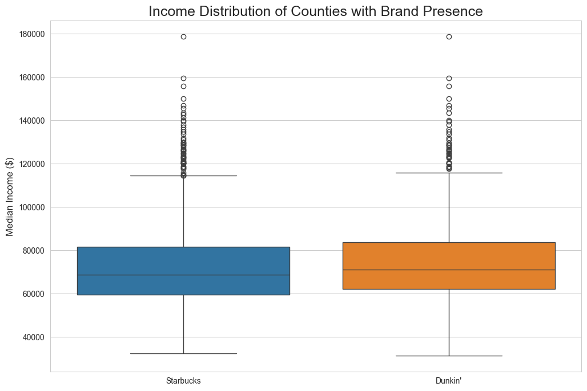

# Starbucks vs. Dunkin': A Strategic Analysis of the U.S. Coffee Market

### [View the Live Interactive Dashboard on Tableau Public](https://public.tableau.com/app/profile/peter6884/viz/StarbcuksVsDunkin/NationalView?publish=yes)

---

## 1. Introduction

### The Elevator Pitch

> This project is an end-to-end competitive analysis of the U.S. market presence of Starbucks and Dunkin'. The workflow begins with a custom Python web scraper to reverse-engineer a private API and acquire 17,000+ live Starbucks locations. This proprietary dataset is then integrated with a public Dunkin' dataset and U.S. Census data (population & income). The analysis culminates in a sophisticated "Opportunity Score" and a "Market Landscape" segmentation for over 3,000 U.S. counties. The final result is a multi-level, interactive dashboard in Tableau designed for strategic exploration of potential expansion markets and the nuanced, data-driven strategies of both corporate giants.

### Motivation (The "Why")

> This project began with a personal connection and a spark of intense curiosity. When my girlfriend started her new role at Starbucks. I saw a fascinating intersection of my personal life and a massive, data-rich corporation.
>
> For me, as someone passionate about data, this wasn't just a life event; it was an opportunity. I wanted to move beyond textbook examples and apply my skills to a real-world business landscape. How does a giant like Starbucks make its decisions? Where are the hidden patterns in their vast network of stores? What story could the data tell about their strategy, their competition, and the untapped corners of the market? This project is the result of that curiosity: an effort to translate a personal connection into a deep, data-driven analysis of a globally recognized brand.

### Key Business Questions

> * What is the optimal strategy for market expansion: capturing uncontested "Blue Ocean" markets or continuing to build in hyper-saturated urban centers?
> * Which brand, Starbucks or Dunkin', dominates which regions of the country, and where are the key competitive battlegrounds?
> * What is the true, data-driven relationship between each brand's store footprint and the wealth of a county, and does it challenge popular stereotypes?
> * Which states offer the best overall strategic opportunity for market expansion?

---

## 2. The Methodology: From Raw Data to Actionable Insight

This project followed a comprehensive data science lifecycle, executed in four distinct phases.

### Tools & Technologies

* **Data Acquisition:** Python (`requests` library for web scraping)
* **Data Processing & Analysis:** Python (`pandas`, `numpy`), Jupyter Notebook
* **Data Visualization:** Tableau Public
* **Supporting Tools:** Git, GitHub

### Data Sources

1.  **Starbucks Locations:** Proprietary dataset of 17,000+ locations acquired by building a custom web scraper to query a private API on the official Starbucks website.
2.  **Dunkin' Locations:** Publicly available dataset from Kaggle, providing a comprehensive list of U.S. store locations.
3.  **U.S. Demographics:** County-level population and median household income data sourced from the U.S. Census Bureau's American Community Survey (ACS) 5-Year Estimates.
4.  **Geographic Data:** A U.S. zip code database from SimpleMaps was used to map store locations to their respective counties.

### The Data Pipeline

#### **Phase 1: Data Acquisition & Engineering**

The project began with the most technically challenging phase: acquiring the Starbucks location data. A Python script was engineered to systematically query a private API, requiring a process of reverse-engineering the browser's network requests to replicate a full suite of headers and bypass server-side security. This script successfully gathered over 17,000 live store locations.

#### **Phase 2: Data Cleaning, Merging & Standardization**

All data sources were loaded into a Jupyter Notebook for processing with the `pandas` library. This phase involved:

* **Cleaning:** Parsing messy, multi-columnar data from the U.S. Census Bureau to extract only the necessary population and income fields.
* **Standardization:** A critical step was creating a standardized "county_full_name" key across all datasets. This required solving complex data bugs, such as reconciling the different geographic naming conventions used for Connecticut's "Planning Regions" and Alaska's "Boroughs" between the zip code and census data.
* **Merging:** The Starbucks and Dunkin' datasets were merged with the zip code data to assign a county to each of the ~27,000 total store locations.

#### **Phase 3: Modeling & Analysis**

With a clean, unified dataset, two key analytical models were developed:

1.  **The Opportunity Score:** A normalized, balanced score was calculated for each county. It ranks the "population per shop" and "median income" on a 0-to-1 scale and averages them, providing a sophisticated metric that identifies markets with both high demand (few stores per person) and high value (strong purchasing power).
2.  **Market Landscape Segmentation:** A classification model was created to segment each county into one of several strategic categories: "Starbucks Stronghold," "Dunkin' Dominion," "Competitive Market," or the highly valuable **"Priority Untapped Market"** (defined as having no stores but meeting data-driven population and income thresholds).

#### **Phase 4: Visualization & Storytelling**

The final, enriched dataset was exported to Tableau Public to create a professional grade, interactive dashboard. The design focused on a guided user experience:

* **Multi-Level Drill-Down:** Implemented a key feature allowing users to navigate seamlessly from a high-level **National View** to a detailed, filtered **State View** with a single click on the map.
* **Interactive Views:** Developed a dual-axis master map to visualize both opportunity score (via color) and market landscape (via custom brand logo shapes) in a single, data-dense view. Added seamless button navigation to switch between this and a dedicated "Brand Dominance" map.
* **Dynamic Controls:** Integrated a full suite of controls, including a state-selection dropdown, KPI banners that update on selection, and dynamic "Top 10" charts that update based on the user's focus, creating a truly exploratory tool.

---

## 3. Key Findings & Strategic Recommendations

The analysis yielded several actionable insights, culminating in a strategic framework for market expansion.

### Finding 1: The Strategic Dichotomy of Expansion—"Blue Ocean" vs. "Urban Infill"

The data reveals that "opportunity" is not monolithic. The model identified two distinct, viable paths for growth:

* **"Blue Ocean" Strategy:** The analysis isolated a ranked list of "Priority Untapped Markets"—counties with zero major coffee shops but with strong underlying fundamentals (population and income above the national 25th percentile). These are opportunities for **market capture**, where a new store can fill a void in a promising, uncontested area. The top targets were identified not as remote rural areas, but as wealthy, high population suburban counties that have been overlooked.
* **"Urban Infill" Strategy:** Paradoxically, the most saturated markets like Los Angeles County (788 Starbucks) still rank as "Very High" opportunity. The data shows why: even with hundreds of stores, the population to store ratio can be as high as **7,000 people per shop**. The opportunity here is not to fill a void, but to capture a slice of an immense, proven, and wealthy economic pie.

**Recommendation:** A dual-pronged expansion strategy should be employed, targeting both uncontested "Blue Ocean" markets for new customer acquisition and hyper-saturated "Urban Infill" markets for high-volume revenue growth.

### Finding 2: Data-Driven Brand Strategy—"Mass Market vs. Premium Saturation"

The analysis disproves the simple stereotype that Starbucks is exclusively for high income areas and reveals the nuanced truth:

* **Dunkin' (Mass-Market Saturation):** With an average county income of ~$75k, Dunkin' employs a mass market strategy, maintaining a heavy footprint across a vast range of lower to upper middle income counties.
* **Starbucks (Premium Saturation):** With a similar average county income of ~$72k, Starbucks' strategy is different. The data shows they largely avoid the lowest income markets and concentrate their densest store footprints in wealthier suburban and urban counties.

**Recommendation:** Competitors should recognize that while both brands have wide appeal, their core strategic focus differs. Starbucks competes on premium placement, while Dunkin' competes on ubiquitous presence.

### Finding 3: Clear Geographic Brand Dominance

The competitive landscape is a patchwork of regional strongholds, identifying clear battlegrounds.

* **Dunkin' Dominion:** The Northeast is a fortress for Dunkin', where it often outnumbers Starbucks by more than 10-to-1.
* **Starbucks Strongholds:** The West Coast is controlled by Starbucks, with massive density in California and Washington.
* **The Battlegrounds:** The Midwest, Texas, and Florida emerge as key competitive arenas where neither brand has achieved absolute dominance.

## 4. Conclusion
This project successfully transformed a personal curiosity into a comprehensive, data-driven market analysis. By engineering a custom web scraper, integrating disparate data sources, and developing sophisticated analytical models, this analysis has provided a clear and actionable strategic framework. The final interactive dashboard—featuring multi-level drill downs and dynamic controls serves as a powerful tool for identifying the two distinct types of expansion opportunities ("Blue Ocean" and "Urban Infill") and for understanding the nuanced operational strategies of two of America's most iconic brands.
